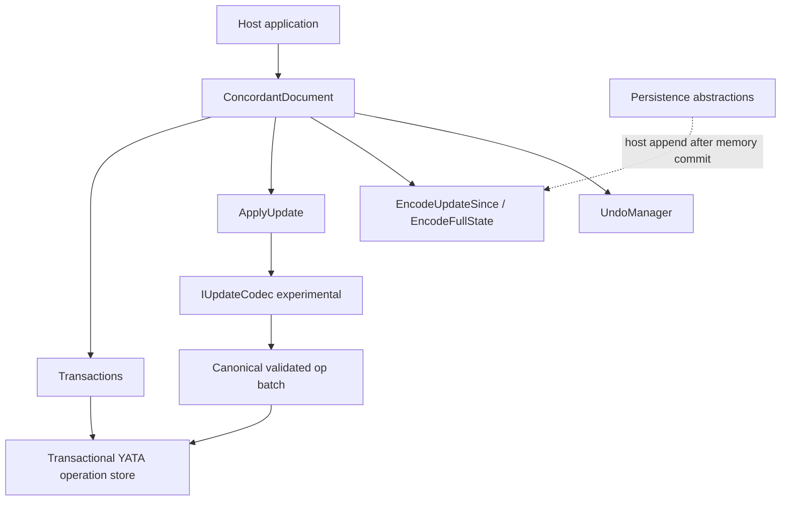

# Concordant Framework Design

**Status:** Approved (peer-reviewed)  
**Targets:** `net8.0` and `net10.0`  
**Packages:** `Concordant.Core`, `Concordant.Persistence.Abstractions`

This document records the approved product design and peer-review rulings that gate implementation. Normative algorithm detail lives in [`../spec/operation-model.md`](../spec/operation-model.md). Architecture rationale for the store shape lives in [`../adr/0001-transactional-struct-store.md`](../adr/0001-transactional-struct-store.md).

## Goals

- Embeddable, transport-agnostic Concordant CRDT library for modern .NET.
- Shared types: plain text, maps, arrays, nested shared nodes, immutable JSON-like scalars.
- Offline-first deterministic merge via native binary updates, state vectors, and full-state checkpoints.
- Selective local undo/redo that preserves concurrent remote edits.
- Correctness before optimization: executable reference model and deterministic simulator gate production storage.

## Non-goals (v1)

- Networking, concrete storage adapters, rich text, schemas, presence/awareness.
- Authentication, authorization, encryption, or ecosystem codecs beyond the native format.
- Destructive tombstone garbage collection or stability-frontier APIs.

## Architecture summary

### Document contract

- Each `ConcordantDocument` is **caller-serialized** and **memory-only**. Concurrent or reentrant calls fail predictably.
- Local commit mutates in-memory state and returns immutable update bytes. Durability is a separate host append step; failed appends do **not** roll back memory and must be retried idempotently.
- Writer identity is a **fresh CSPRNG 128-bit session** per opened document. Checkpoints never restore writable clocks.
- Every insert, delete, map assignment, and root declaration belongs to one contiguous `(SessionId, Clock)` stream.
- State vectors are **contiguous integrated frontiers**. Higher operations may wait as bounded pending data. Diffs therefore include deletions without a separate delete-ack protocol.

### Shared types and values

- `SharedText`, `SharedArray`, and `SharedMap` are typed views over the same operation store.
- Scalars (`ConcordantScalar`): `null`, Boolean, `Int64`, finite IEEE-754 binary64 with canonical `+0` (NaN/infinity rejected), and valid Unicode strings with ordinal equality / canonical UTF-8.
- Text stores **Unicode scalar values** as atomic sequence elements and exposes all public lengths/offsets/ranges/deltas in **UTF-16** units. Malformed strings and offsets that split surrogate pairs reject. No Unicode normalization.
- Nested nodes are created already attached via `CreateMap` / `CreateArray` / `CreateText`, with immutable single-parent ownership. No aliasing, reparenting, cycles, or nested references as scalar values.
- Roots form **one namespace by canonical name**. Same-kind declarations coalesce; concurrent different-kind declarations resolve by minimum declaration `OpId`, emit a conflict warning, retain losing pre-merge content as inaccessible history, and throw on wrong-kind access.

### Ordering and maps

- Sequences use a YATA-style integrator: explicit left/right origins, ancestry, deleted origins remain addressable, deterministic range splitting, and deterministic ID tie-breaks.
- Map winners are registers ordered by validated **Lamport** then **OpId**. Each transaction points at its Lamport source; receivers validate checked `max(previous, source) + 1`. Overflow rejects.

### Apply outcomes

`ApplyUpdate` returns one of:

| Status | Meaning |
|---|---|
| `Integrated` | Batch applied atomically |
| `PendingDependencies` | Accepted into pending under quotas |
| `Duplicate` | Identical IDs ignored |
| `Rejected` | Malformed, unsupported, quota, or replica-fork; zero partial mutation |

Conflicting payloads for an existing ID reject only that update as `ReplicaFork`; the document remains usable. Replicas that accepted opposite fork branches cannot automatically converge.

### Codecs

- Experimental `IUpdateCodec` maps bytes ↔ canonical operation batches and **never** mutates the store.
- Core independently revalidates every batch from every codec under cumulative quotas.

### Undo

- `UndoManager` is session-local, bounded (default 100 transactions / 8 MiB), and **not** checkpointed.
- Insert undo deletes exact local IDs; delete undo reinserts at tombstoned anchors with new IDs; map undo/redo never replaces a currently winning remote assignment.
- Outcomes: `Applied`, `NoVisibleChange`, `RemoteWinner`, `Empty`, `HistoryEvicted`.

### Persistence

- Async append-log and checkpoint abstractions only.
- Core never claims durability. Hosts append returned update bytes after memory commit.

### Quotas and safety

Configurable caps cover update bytes, operation count, retained bytes, historical sessions, nesting, clock gaps, pending ops/bytes, and content size. V1 ships only always-safe normalization (coalescing/dedupe).

## Multi-target policy

- Public packages multi-target `net8.0;net10.0`.
- Behavior, wire format, and public APIs are equivalent across targets.
- Conditional compilation is allowed only for measured runtime optimizations that preserve oracle traces and wire bytes.

## Verification gates

1. Spec + executable reference model + deterministic simulator converge for all valid delivery permutations.
2. Minimized failing seeds become permanent fixtures.
3. Fuzzing, golden vectors, cross-OS compatibility, fixed benchmarks, docs, and `dotnet pack` gate the 0.1 beta.

## Peer-review rulings (accepted)

| Ruling | Decision |
|---|---|
| Store shape | Transactional YATA-style struct/op store (not op DAG / delta-state) |
| Sessions | Fresh CSPRNG session per open; never restore writable identity from checkpoints |
| Deletes | Clocked contiguous operations covered by state vectors |
| Roots | Single name namespace with deterministic kind conflict resolution + warning |
| Nested ownership | Construction-only attached; immutable single parent |
| Snapshots | Full-state checkpoint create vs merge are separate paths |
| GC | No destructive tombstone GC in v1 |
| Durability | Memory commit ≠ durable append |
| Codec | Experimental + core revalidation |
| Fork | Atomic update rejection; document not poisoned |

## Next phase

`0.1.0-beta.2` stabilizes the production kernel: atomic `Transact`, indexed pending/YATA/UTF-16 paths, canonical state-vector encode/decode, and release/performance gates.

**Next (`beta.3`):** first production persistence package (prefer SQLite) plus a reference host recovery/sync sample. Transport policy stays outside `Concordant.Core`.

Later: RC/1.0 for API/wire freeze, soak tests, and support guarantees. Rich text, presence, encryption, ecosystem codecs, and destructive tombstone GC remain deferred.
